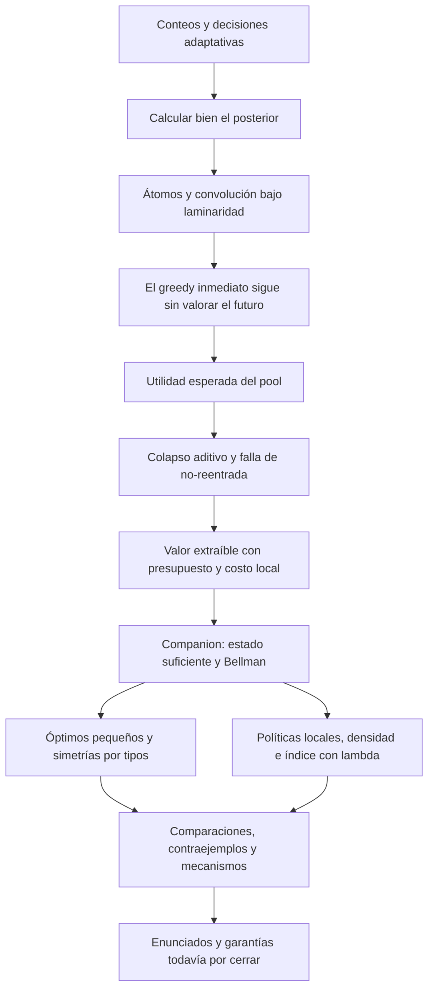

# Ruta de investigación para conversar con Francisco

Reconstrucción del 21 de septiembre de 2026 a partir del companion, las actas y esta copia del repositorio. La sesión de presentación del PDF está documentada el **25 de agosto**. Las notas posteriores se distinguen de lo dicho en esa sesión. Las fechas de los commits no necesariamente son las fechas en que surgieron las ideas. No se verificó trabajo en copias privadas ni reuniones posteriores que no estén documentadas aquí.

## 1. La pregunta que conecta el proyecto

**Con pocas pruebas disponibles, ¿cómo aprovechar los conteos para identificar personas sanas de alto valor, tomando decisiones que dependan de lo que ya observamos?**

El objetivo es maximizar la utilidad de quienes quedan identificados como sanos. No es necesario reconstruir el estado de toda la población. Una prueba aumentada da el número de infectados; una política decide qué probar después de cada resultado.

La investigación fue separando dos dificultades:

1. **Inferencia:** calcular correctamente lo que sabemos después de las pruebas.
2. **Planificación:** decidir qué prueba conviene, considerando cuánto presupuesto quedará y qué podremos hacer con sus resultados.

Tener probabilidades exactas resuelve la primera dificultad, pero una decisión basada solo en el cobro inmediato puede seguir siendo mala. Esa observación explica el paso del tensor a los scores, y de los scores a Bellman.

## 2. Secuencia de preguntas, hallazgos y cambios

| Etapa | Pregunta | Qué cambió y por qué |
|---|---|---|
| Exploración inicial, documentada en mayo | ¿Cuánto ayudan el conteo y la adaptación? ¿Cómo compararlos con pruebas individuales y binarias? | Se construyeron solvers pequeños, baselines, árboles y variantes greedy. También se exploraron Gibbs, supernodos y RL. Esas exploraciones forman parte del origen, pero no son todas tareas activas del programa laminar actual. |
| Inferencia exacta; ya reportada el 2-ago | Después de observar conteos, ¿podemos seguir multiplicando probabilidades individuales? | En general, no: aparecen dependencias. La estructura laminar permite trabajar con grupos residuales de conteo conocido y calcular transiciones exactas mediante convolución. El tensor organiza esas probabilidades; no elige por sí solo una buena estrategia. |
| Sesión del 2-ago | ¿Cómo hacer que greedy abra un grupo que paga poco ahora, pero puede revelar una oportunidad? | Francisco propone evaluar la utilidad sana esperada del pool, promediada sobre los resultados. Se intenta dar valor al futuro, además del cobro inmediato. |
| Sesión del 11-ago | ¿Ese promedio mide realmente el valor de la información? | El equipo muestra que colapsa a una suma de utilidades por probabilidades de salud. No valora cómo la prueba hace extraíble esa utilidad. Aparece la propuesta de combinar valor con costo esperado en pruebas y presupuesto restante. |
| Sesión del 18-ago | ¿Por qué el score no vuelve a extraer un sano cuya existencia ya conoce? ¿Cómo medir el costo? | El contraejemplo de no-reentrada expone el fallo. Se precisa que el costo debe medirse después de la prueba y dentro del grupo; se exploran reglas como valor dividido entre costo elevado a un exponente. No surge una regla universal. |
| **Sesión del 25-ago: PDF de Francisco** | ¿Cómo reunir inferencia, acciones legales, planificación y aproximación en un modelo coherente? | El companion formaliza átomos, forma normal, Bellman y seis direcciones. Encargo concreto: implementar la recursión exacta y cotejar el ejemplo pequeño; seguir verificando el documento. |
| Trabajo registrado del 1 al 9-sep | ¿Qué hacen el óptimo y las heurísticas en ejemplos concretos? ¿Dónde fallan? | Hay Bellman implementado, políticas de densidad, búsqueda de contraejemplos, índice con λ y solver homogéneo por tipos. Esto proporciona instrumentos y evidencia; no cierra una garantía general. |
| Planes del 10–11-sep | ¿Cómo convertir lo explorado en resultados defendibles? | Priorizar validación reproducible, mapas de decisiones, redacción del modelo y enunciados precisos. Los planes contienen tareas propuestas: su sola aparición allí no prueba que estén terminadas. |

Fuentes: [estado de mayo](/Users/hectorbecerrilvillamil/Desktop/GroupCounting/group-count-dynamic/docs/notes/estado_proyecto_2026-05.md), [2-ago](/Users/hectorbecerrilvillamil/Desktop/GroupCounting/group-count-dynamic/docs/notes/2026-08-02-sesion-francisco.md), [11-ago](/Users/hectorbecerrilvillamil/Desktop/GroupCounting/group-count-dynamic/docs/notes/2026-08-11-sesion-francisco.md), [18-ago](/Users/hectorbecerrilvillamil/Desktop/GroupCounting/group-count-dynamic/docs/notes/2026-08-18-sesion-francisco.md), [25-ago](/Users/hectorbecerrilvillamil/Desktop/GroupCounting/group-count-dynamic/docs/notes/2026-08-25-sesion-francisco.md), [plan del 10-sep](/Users/hectorbecerrilvillamil/Desktop/GroupCounting/group-count-dynamic/docs/notes/2026-09-10-plan-semana.md).

## 3. Qué aporta el PDF que recuerdas

El [companion de Francisco](/Users/hectorbecerrilvillamil/Desktop/GroupCounting/dynamic_augmented_laminar_companion.pdf) convierte las preguntas anteriores en un programa de investigación. Sus seis direcciones son:

| Dirección | Traducción para la discusión | Secciones |
|---|---|---|
| 1. Forma normal | Representar las decisiones útiles como abrir un grupo sin probar o refinar un átomo pendiente. | §3–4 |
| 2. Bellman | Escribir cuánto vale la mejor continuación desde cada estado. | §5 |
| 3. Cómputo exacto | Usar la recursión en casos pequeños y explotar personas intercambiables por tipos. | §6 |
| 4. Heurísticas | Comparar cobro inmediato con valor que puede extraerse usando varias pruebas. | §8 |
| 5. Ejemplo de separación | Comprobar si las políticas aprovechan el régimen donde los conteos y la planificación ofrecen una gran ventaja. | §7 y §9 |
| 6. Garantías | Delimitar qué fracción del óptimo puede asegurarse y bajo qué restricciones. | §10 |

La correspondencia entre el tensor previo y los polinomios del PDF es directa: ambos calculan las probabilidades de conteo y de los refinamientos. El PDF aporta una organización y una formulación común para conectarlos con decisiones futuras.

En esa sesión también se eligió **posterior-zero**: cobrar a quien el historial demuestra sano, incluido un complemento sano por deducción. Esa decisión ya forma parte del modelo actual. Solo necesitamos etiquetar los resultados anteriores que usaban otra convención.

**Estado del documento:** el PDF enuncia resultados como demostrados, pero Francisco pidió revisar las pruebas; señaló especialmente §8 en adelante como material nuevo. Conviene distinguir «el companion afirma» de «el equipo ya verificó». Su programa tampoco afirma haber cerrado una aproximación por constante universal para el problema general.

### Bellman, en el lenguaje que ya hemos practicado

El estado resume personas todavía sin probar, átomos pendientes con sus conteos y presupuesto restante. Esquemáticamente:

\[
V_b(s)=\max\left\{0,\ \max_{T\text{ legal}}\sum_r
P(r\mid s,T)\left[g(s,T,r)+V_{b-1}(s')\right]\right\}.
\]

Para cada prueba posible: **probabilidad de una rama × (utilidad que cobras en esa rama + mejor utilidad futura desde ahí)**. Sumas las ramas y eliges la prueba con mayor total. Es la misma cuenta de esperanza que practicamos, aplicada recursivamente. El cero permite parar; con cero pruebas restantes, el valor adicional es cero.

Bellman sirve para obtener un óptimo de referencia, guardar su árbol y entender decisiones que las heurísticas no anticipan. Resolverlo globalmente puede ser caro aunque cada actualización del posterior sea eficiente.

**Bellman también existe sin restringirse a laminar.** En ese caso puede conservarse el posterior conjunto sobre los perfiles de infección compatibles con toda la historia y considerar cualquier pool de tamaño a lo sumo G, incluidos cruces. La laminaridad permite una representación más estructurada; no es un requisito del principio de Bellman. El proyecto ya tenía [una DP general sobre perfiles](/Users/hectorbecerrilvillamil/Desktop/GroupCounting/group-count-dynamic/augmented/solver.py:59), cuyo cobro sigue siendo estricto, y [una DP irrestricta homogénea con crédito por deducción](/Users/hectorbecerrilvillamil/Desktop/GroupCounting/group-count-dynamic/augmented/experiments_separacion_n10.py:123), sin un límite G separado del tamaño de población. Por tanto, la aportación del companion es la caracterización y estructura laminar, no la primera aparición de programación dinámica en el proyecto. Para comparar ambos óptimos hay que igualar convención, población, utilidades, B y G.

Ojo con la letra V: el viejo **score del pool** y el **valor óptimo de continuación de Bellman** son objetos distintos. Que el primero colapse a una suma no significa que Bellman colapse.

## 4. Dónde entran π y λ

**π es una política:** una regla que, dado lo observado y el presupuesto, decide la siguiente acción. No es una probabilidad de infección. Cada subíndice identifica una regla diferente.

| Política | Idea |
|---|---|
| π_M, inmediata | Elegir la prueba que da más utilidad esperada ahora. |
| π_C, densidad con compromiso | Elegir un plan local por valor extraíble/pruebas reservadas y seguir ese bloque. |
| π_R, densidad con reevaluación | Elegir por densidad, ejecutar el primer paso y reevaluar después de observar. |
| π_L, índice Lagrangiano | Valorar un plan local por utilidad esperada menos λ por cada prueba esperada, permitiendo abandonarlo. |

El índice con λ **ya aparece en el PDF, ec. 8.13**. Su implementación posterior no es un giro desligado del proyecto: explora la pregunta de cómo asignar pruebas cuando el gasto depende de los resultados. Una rama mala puede abandonarse pronto; otra puede justificar refinamientos.

λ es el precio en utilidad que se asigna a consumir una prueba. No es el presupuesto B ni un parámetro necesario de Bellman original. En la implementación local sigue habiendo un tope de pruebas: penalización y tope cumplen funciones diferentes. Elegir λ, el horizonte y la regla ante índices no positivos forma parte de especificar π_L.

Fuentes de implementación: [Bellman mínimo](/Users/hectorbecerrilvillamil/Desktop/GroupCounting/group-count-dynamic/augmented/bellman_minimo.py), [políticas de densidad](/Users/hectorbecerrilvillamil/Desktop/GroupCounting/group-count-dynamic/augmented/densidad_companion.py), [índice Lagrangiano](/Users/hectorbecerrilvillamil/Desktop/GroupCounting/group-count-dynamic/augmented/indice_lagrangiano.py), [Bellman homogéneo por tipos](/Users/hectorbecerrilvillamil/Desktop/GroupCounting/group-count-dynamic/augmented/bellman_tipos.py).

## 5. Los ejemplos cumplen funciones distintas

| Ejemplo | Qué permite entender | Qué no permite concluir |
|---|---|---|
| Separación entre pruebas binarias y aumentadas | Por qué los conteos, junto con decisiones futuras, pueden ser valiosos incluso si casi todos están infectados. | Que cualquier heurística aproveche esa ventaja. |
| No-reentrada, AB ya tiene conteo 1 | Un score puede reconocer que existe utilidad sana y aun así no elegir cómo extraerla. Justifica considerar continuación y costo. | Que ese score sea Bellman o que todas las reglas locales fallen del mismo modo. |
| Instancia heterogénea de seis personas | La batería implementada obtiene aproximadamente 0.658 del óptimo laminar; π_L con la configuración estudiada alcanza aproximadamente 0.964. Obliga a estudiar apertura, refinamiento y cambio de componente según el conteo. | Que no exista ninguna garantía constante para heurísticas, o que π_L siempre alcance 0.964. |

El contraste de seis personas es evidencia sobre las implementaciones y configuraciones estudiadas. Se identificó un problema en el score inmediato: para acreditar el complemento usaba un evento distinto de «el subpool contiene todos los infectados del átomo». **Actualización del 21-sep:** se corrigió y se verificó por enumeración. La instancia de seis personas conserva los resultados de la batería. La nueva comparación exacta general/laminar y el [guion centrado en contraejemplos](/Users/hectorbecerrilvillamil/Desktop/GroupCounting/group-count-dynamic/docs/notes/2026-09-21-repaso-contraejemplos-francisco.md) completan este mapa.

Las notas del portafolio reportan 0.9307 después de afinar λ en una instancia candidata. El scoreboard contiene mediciones con rejillas distintas. Ese número no debe presentarse como una garantía ni como mínimo consolidado de toda la búsqueda sin reevaluación uniforme. Un portafolio elige **antes de ejecutar** mediante valores esperados calculados o estimados; no escoge retrospectivamente el resultado más favorable.

## 6. Cómo encajan los notebooks que intentabas entender

- **24:** los ejemplos que hacen visibles la miopía y el colapso del score, junto con comparaciones pequeñas.
- **25:** amplía comparaciones y desarrolla las peticiones sobre valor y costo. Su parte II recoge una parte de ese material; no es una línea de investigación independiente.
- **26:** corrige el costo a local y posterior a la prueba, desarrolla no-reentrada y ensaya reglas; después incorpora Bellman y el modelo posterior-zero. `26_esencial` condensa y añade el contraste heterogéneo.
- **Los módulos posteriores:** desarrollan π_M, π_C, π_R, π_L y el solver por tipos. Para entender π_L hay que salir de esos tres notebooks y mirar su módulo y la ec. 8.13.

La copia actual del notebook 25 está modificada y contiene solo tres celdas; su comparación histórica se apoyó en la versión guardada en Git y en 25-II. No se restauró ni sobrescribió tu archivo.

## 7. Qué rutas siguen abiertas

Hay dos comparaciones científicas diferentes:

\[
\frac{W(\pi)}{\mathrm{OPT}_{\mathrm{lam}}}
\qquad\text{y}\qquad
\frac{\mathrm{OPT}_{\mathrm{lam}}}{\mathrm{OPT}_{\mathrm{aug\ sin\ restricción}}}.
\]

La primera mide cuánto pierde nuestra política frente al mejor plan laminar. La segunda mide cuánto cuesta restringirse a laminar. Bellman laminar proporciona el denominador de la primera; por sí solo no resuelve la segunda. Una garantía frente al óptimo sin restricción necesitaría conectar ambas.

| Ruta | Próxima pregunta útil | Estado y alcance |
|---|---|---|
| Base verificable | ¿Las transiciones, el cobro y las políticas implementadas coinciden con las definiciones? | Ya hay enumerador independiente por perfiles, ocho comparaciones, 28 pruebas y corrección del cobro del complemento. Queda ampliar al alcance completo del plan. |
| Estructura del óptimo | ¿Cuándo conviene abrir otro grupo, refinar uno pendiente o cambiar de componente? | El solver homogéneo por tipos permite buscar mapas y umbrales. No equivale todavía a un solver general eficiente para muchas clases heterogéneas. |
| Política realizable | ¿Qué regla de λ y qué horizonte se pueden fijar antes de ver los resultados? ¿Con qué costo computacional? | Hay evidencia favorable en ejemplos; la especificación y la garantía siguen abiertas. |
| Teoría de aproximación | ¿Empezamos con grupos iniciales fijos y asignación de presupuesto, o incluimos ya la elección de integrantes? | El PDF propone separar estas dificultades. Sus resultados restringidos no se trasladan automáticamente al problema general. |
| Redacción y contribución | ¿Qué resultados del companion están revisados y cuáles corresponden a este trabajo y al otro paper? | Es una cuestión explícita de la sesión del 25-ago que conviene actualizar con Francisco. |

## 8. Tu parte y una conversación concreta

Según el reparto del 10–11 de septiembre, **Héctor/B convierte las preguntas en evidencia reproducible y explica el mecanismo de los resultados**. Vladimir/A lleva la formulación y las pruebas, con revisión cruzada. Tu presentación puede seguir cuatro pasos:

1. Qué pregunta motivó cada experimento.
2. Qué hace el óptimo en un árbol pequeño y por qué.
3. Dónde se aparta la heurística y qué cambia al introducir π_L.
4. Qué se ha comprobado, en qué configuración, y qué sigue siendo conjetura.

Para esta conversación propondría resolver cinco preguntas:

1. ¿Qué partes de §8–10 del companion considera Francisco ya revisadas, y cuáles quiere que ataquemos primero?
2. ¿El siguiente resultado debe ser un umbral homogéneo, una garantía con grupos fijos o una política general?
3. ¿Qué regla concreta de λ y qué costo computacional aceptaríamos como algoritmo definido?
4. ¿Qué evidencia mínima necesita para pasar de los contraejemplos y mapas a un enunciado?
5. ¿Cómo se reparte la escritura y qué resultados se integran en cada paper?

### Guion de apertura, aproximadamente 90 segundos

> Entiendo la ruta así: empezamos comparando estrategias con conteos y resolviendo cómo actualizar correctamente las probabilidades. La estructura laminar nos dio una forma manejable de hacer esa inferencia, pero el greedy seguía sin valorar bien el futuro. Probamos puntuar la utilidad sana esperada; vimos que ese promedio colapsa y puede no volver a extraer utilidad que ya sabemos que existe. Eso llevó al costo local y a pensar en el presupuesto de continuación.
>
> Tu companion reúne esas piezas: define el estado con átomos, da Bellman como referencia exacta y plantea políticas que usan valor extraíble. Después implementamos herramientas para comparar esas políticas y buscar fallos; el índice con λ es una de las rutas del propio documento para tratar gastos que dependen de las ramas.
>
> Quiero confirmar contigo qué parte teórica ya está cerrada y cuál debe ser nuestro siguiente objetivo. Distingo mejorar una política frente al óptimo laminar de demostrar que restringirse a laminar pierde poco. Mi parte puede aportar árboles, comparaciones y mapas reproducibles para la pregunta que prioricemos.

## 9. Orden de lectura para recuperar el hilo

Primero este mapa. Después, el PDF en este orden: **§1 y tabla 1 → §2–5 → §8.3 → §10.3 y §11**. Así sabes qué problema resuelve cada herramienta antes de entrar en las pruebas. Luego vuelve a los notebooks 24–26 con la pregunta «¿qué dificultad motivó este cambio?». La [guía de estudio](/Users/hectorbecerrilvillamil/Desktop/GroupCounting/group-count-dynamic/docs/notes/2026-09-14-sesion-estudio-hector.md) conserva las cuentas, contraejemplos y verificaciones para profundizar.
